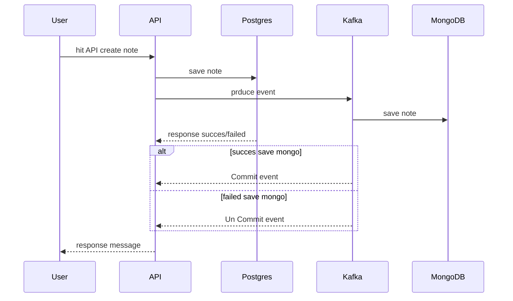

## This NodeJs Rest API Repository

this is NodeJs Rest API with `postgres` as primary database, in this repo express framework used to build the Rest API. and [sequelize](https://sequelize.org/docs/v6) is used to build database model and migration.

### whats implemented in this repo
1. Rest API
2. Messaging using Kafka
3. Combine producer and consumer as one App
4. Combine postgres and mongodb as one App (postgres as primary database and mongodb for receive event data from kafka)

### Messaging Workflow

## How to Run App (install dependencies / prequisites)
<!-- init project -->
1. npm init  
<!-- add dependecies -->
2. npm add -D typescript ts-node @types/node @types/express nodemon
<!-- add tsconfig -->
3. ./node_modules/.bin/tsc --init
<!-- tsconfig script must be uncomment -->
4. "outDir": "./build"
<!-- add script -->   
5. add script tsc :dev "tsc && nodemon ./build/index.js"

### How to RUN APP
1. npm install
2. npm run tsc:dev

